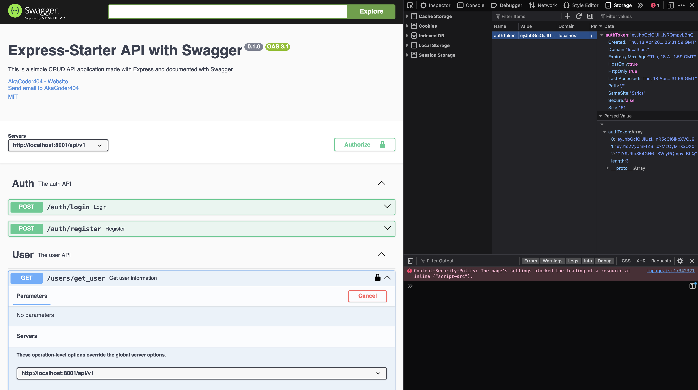

# Express-Starter

[![CI status][ci-badge]][ci-workflow]

[ci-badge]: https://github.com/AkaCoder404/Express-Starter/actions/workflows/main.yml/badge.svg
[ci-workflow]: https://github.com/AkaCoder404/Express-Starter/actions/workflows/main.yml

This is a boilerplate/starter project for quickly building an express js server to build a RESTful APIs. It contains what I believe is a good app architecture should be. All suggestions are appreciated! Currently, it has boiler plate code for a 3 layer architecture. More can be found here about Express.js project architecture here on [飞书](https://lft4un1s0v.feishu.cn/docx/ILghd7ICiott1Yxkbbcc3BZ5nHc?from=from_copylink).

~~By default, we use MySQL as the database. In this case, since we don't use an ORM, we can make calls directly in the service layer, therefore `models/` is left blank.~~

The database used is MongoDB as it seems more popular in the Express/Node.js world. But if you want to run it, checkout an older readme.md at `docs/readme_v1.md`

## Running
In order to quickly run the project. 

1. Install the correct node version using `nvm use`
2. Install packages using `npm install`
3. Setup MySQL database server using `docker-compose --env-file .env -f docker/docker-compose-mongodb.yml up -d`, and create `.env` file with DB information. Example shown below
4. Create a JWT token using `openssl rand -base64 32` or other methods.
```sh
PORT=8001

# MongoDB
MONGO_HOST="localhost"
MONGO_PORT="27017"
MONGO_USER="root"
MONGO_PASSWORD="root"
MONGO_DATABASE="test"

JWT_SECRET="secret"
JWT_EXPIRES_IN="1h"
```
5. Run project using `npm run dev`. 


## Project Structure
The project hiearchy is shown below
```s
src\
 |--config\         # Environment variables and configuration related values
 |--controllers\    # Route controllers (controller layer)
 |--docs\           # Swagger files
 |--models\         # Mongoose models (data layer)
 |--schema\         # Contains Mongoose Schemas
 |--routes\         # Routes
 |--services\       # Business logic (service layer)
 |--utils\          # Utility classes and functions
 |--validations\    # Request data validation schemas
 |--app.js          # Express app entry
 |--database.js     # Database connection
 |--middleware.js   # Custom express middleware
tests\              # Contain tests
```

## API Documentation
This sample API has one main resource/component, which has the following paths.

```sh
api/v1/auth/login          # POST request
api/v1/auth/register       # POST request
api/v1/auth/login_cache    # GET request
api/v1/users/create_user   # POST request
api/v1/users/get_user      # GET request
api/v1/users/get_users     # GET request
api/v1/users/update_user   # PUT request
api/v1/users/delete_user   # DELETE request
```

## Functionality
This boilerplate includes...
1. 3 Layer Architecture
2. Middleware Support
3. JWT for Authentication
4. Basic Unit and Integration Tests
5. Github Workflow for CI/CD
6. Data Safety - Password Hashing
7. API Documentation with Swagger
8. Simple Redis Login Counter Cache

## E2E Testing
Swagger documentation is set up at `docs`. Remember to use authorization by copying value of `authToken` from browser cookies to `Authorize` button after `/auth/login` or `/auth/register` has been called.



## Middleware

## Database


## Tips
Here are some more tips.
1. Separate config files based on purpose. `db.config.js` for database configurement, `thirdparty.config.js` for third party app configurement, etc...
2. Understand your data layer needs, comparing data driver (handwritten SQL queries) vs ORM models to define how `models/` should be used.
3. 

## TODO
- AWS CloudFormation templating for easy aws deploy
- Pub/Sub Component
- Authorization/Validation
- Loaders logic seperation
- Seperate Model Logic from Controller


